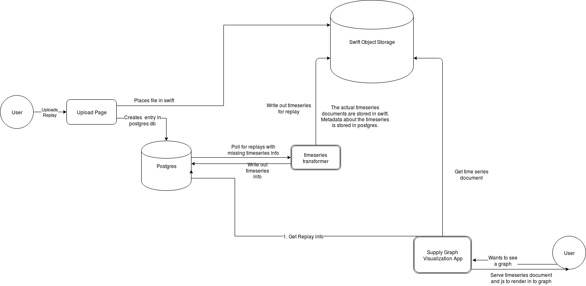

==========
cheeseshop
==========

Getting Started
---------------

Install cheeseshop via pip

.. code:: shell

     git clone https;//github.com/ibm-dev-incubator/cheeseshop
     cd cheeseshop
     pip install .

Create and edit config file

.. code:: shell

    cp example_config.yaml config.yaml
    vim config.yaml

Start the service

.. code:: shell

    cheeseshop-webapp config.yaml

architecture
------------

workers
-------

Workers are installed as executables. They are all named 'cs-worker-something' and take a sha1sum as an argument. Right now workers pull from the filesystem but soon they will pull from swift. The `player_names` worker can be used as a starting point for other workers.

.. code:: shell

    $ export REPLAY_DIR=/home/nibz/projects/starcraft/replays/

    $ ls $REPLAY_DIR
    78083d5db81c444c7db4999f30112ba5a2478ee5.SC2Replay
    780b06373679b1ecd022a317fa34fe370744dad2.SC2Replay
    781f3fb92616536fd3d4154f1253c880aa67b862.SC2Replay
    78222a03bfdb0e3748146c4c6d4393eb7d84c14f.SC2Replay

    $: cs-worker-supply_breakdown --sha1sum 78640b49e919fb0a6f14e173dfb636839760812f | jq '.' | head
    {
      "map": "Echo LE (Void)",
      "players": [
        {
          "name": "MarineLorD",
          "army_supply": [
            {
              "data": [
                {
                  "y": 0,

